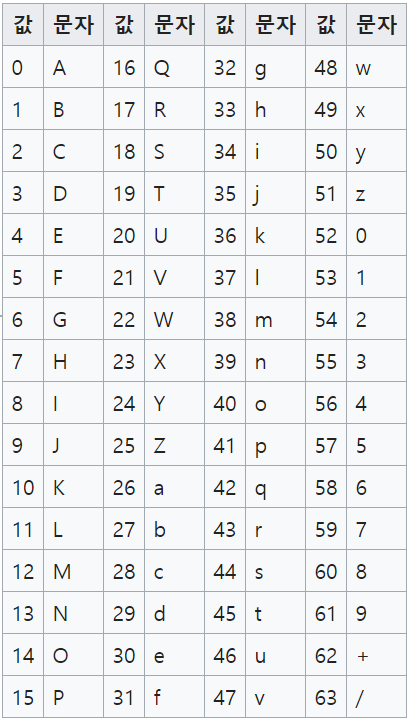
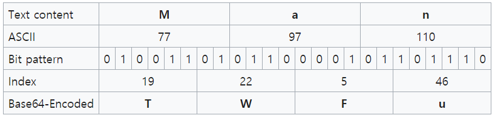

# Basic Concept

SW Expert를 풀면서 필요했던 **기본개념**을 기록한다.

## Base 64

**Base64**란 8bit 이진데이터를 ASCII문자로 바꾸는 인코딩 방식.

- **Base64 색인표**

* **원리**
 8bit의 이진데이터를 6bit씩 잘라 문자를 얻는다. 
 단위는 24bit씩이다.  
 따라서 24bit를 입력받으면 3개의 문자를 입력 받는 것이 되고, 이를 6bit씩 잘라 4개의 문자를 얻게 된다.

* **예시**

	* 입력이 24bit가 아닌 경우?
	: bit수를 맞춰주기 위해 0으로 채워주게 되고, 이는 '='문자가 되어 추가된다.
	즉, 3n이 아닌 수가 입력되면 그 외의 수만큼의 '='문자가 생김.