# Sequential Circuits
                      [ 컴퓨터회로 기말고사 범위 ]

* 순차회로 & Latch
* Flip-flop
* Counter

---
---
# 순차회로

이전 상태의 신호와 외부 입력 신호에 따라 출력이 결정되는 회로

##  Memory

메모리에는 최소한 세가지 속성이 있어야 한다.
1. **Hold** a value
2. **Read** the value that was saved
3. **Change** the value that's saved

## SR latch

Inverter대신 NOR gate를 이용하여 S와 R input으로 Q와 Q' output을 제어할 수 있다.

 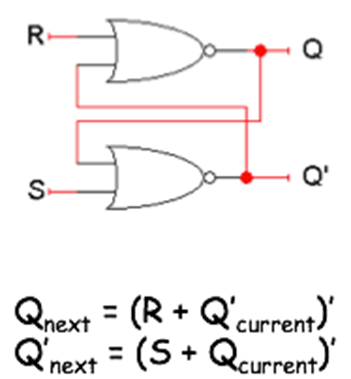

1. S = 0 and R = 0?
  - **No change**
  - Qnext = ( 0 + Q'current )' = Qcurrent
	 Q'next = ( 0 + Qcurrent )' = Q'current 
  - 따라서, Qnext = Qcurrent
  - 즉, Qcurrent에 따라 Qnext는 0 또는 1이 될 수 있다
  - 이전의 상태에 따라 동일한 입력이 다른 출력을 생성할 수 있음을 보여줌
 
2. S = 1 and R = 0?
  - **Set**
  - Q'next = ( 1 + Q'next )' = 0
    Qnext = ( 0 + 0 )' = 1
  - 따라서, Q'next = 0이고, Qnext = 1
  - 즉, SRlatch를 1로 설정하라는 것을 의미 

 3. S = 0 and R = 1?
   - **Reset**
   - Qnext = ( 1 + Q'current )' = 0
     Q'next = ( 0 + 0 )' = 1
   - 따라서, Qnext = 0이고 Q'next = 1
   - 즉, SRlatch를 0으로 재설정하라는 것을 의미
  
 4. S = 1 and R = 1?
   - **Avoid** Don't ever set SR=11
   - Qnext와 Q'next 모두 0 또는 1이 된다. 이는 Q와 Q'가 invert 관계가 아님
   - 무한 루프가 될 것 
 
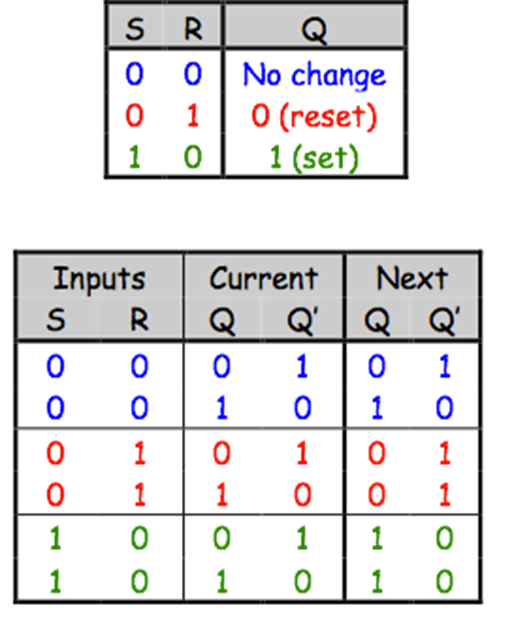
 
  Q와 Q '의 다음 값이 입력 값 S와 R뿐 아니라 현재 값에도 의존한다는 것을 보여준다.

## S'R' latch

NOR gate를 사용했던 SR latch와 달리 NAND gate를 사용하여 S'R' latch 설계.
Invert S (S')와 Invert R (R')을 input으로 한다.

## SR latch with a Control input

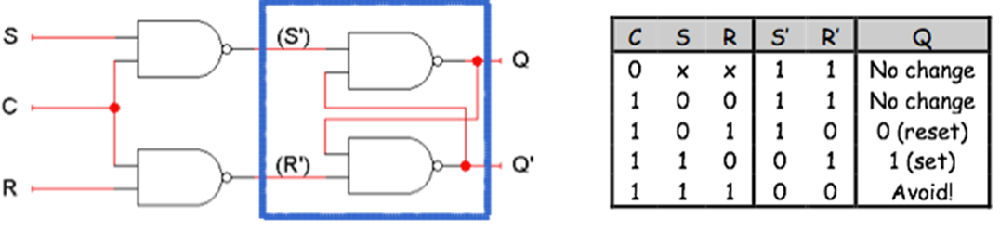

S'R' latch에 추가적인 NAND gate를 이용하여 S와 R, Control을 input으로 설계
Control은 Enable역할을 한다.

## D latch

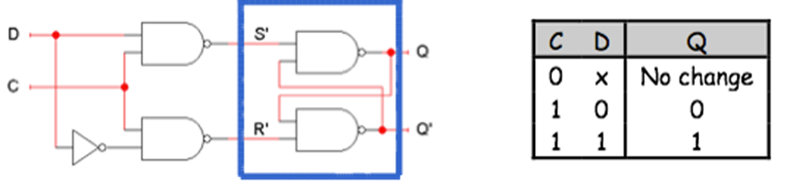
S'R' latch를 기반으로, 입력 D(data) 와 C(control)을 기반으로 S'와 R'을 생성한다.
 * C = 0일 때,  S '와 R'이 모두 1이므로 상태 Q는 변경되지 않는다.
 * C = 1일 때, 래치 출력 Q는 입력 D와 같습니다.

## Latch의 문제점
 * 정확한 시점에 래치를 비활성화 해야할 때와 활성화 해야할 때, 일반적으로 작업 소요 시간 및 래치 활성화 시간을 아는 것은 매우 어렵다. 
 * latch의 **타이밍 제어**하는 것이 어려움. -> Flip-Flop으로 개선

---
---
# Flip-flop

대형 회로의 latch 타이밍 제어가 어려운 문제를 해결하기 위해 사용한다.
Clock과 Flip-flop을 이용하여 문제 해결.
**Clock**은 Memory에 언제 써야하는지 알려주는 기능
**Flip-flop**은 정확하게 정의된 시간에 메모리를 빠르게 쓸 수 있게 하는 기능
즉, 클럭과 플립플롭을 사용하여 타이밍 문제를 해결할 수 있다.

* ALU가 래치의 내용을 읽고 연산 중에는 래치를 비활성화 시켜 새로운 값을 읽지 않도록 한다.
* ALU가 연산동작을 끝내면 래치를 활성화 하고, 업데이트 된 값을 저장하도록 한다. 
* ALU가 새로운 값을 읽고 연산결과를 생성하기 전에 다시 신속하게 래치를 비횔성화 해야한다

## Clock

Clock의 출력은 0과 1이 연속적으로 변경되는 장치.
**클럭 주기**: 클럭이 1에서 0으로 변경되고, 다시 1로 변경되는 데 걸리는 시간.
** 클럭 빈도** : 클럭 주기의 역. 단위는 헤르츠
클럭은 회로를 동기화 하는데 사용된다.
클럭 신호는 래치의 Control에 접속되어 래치를 제어한다. 

## Flip-flop

래치를 순간적으로 활성화 시키는 역할을 한다. 
* D Flip-flop
* JK Flip-flop
* T Flip-flop

## D Flip-flop

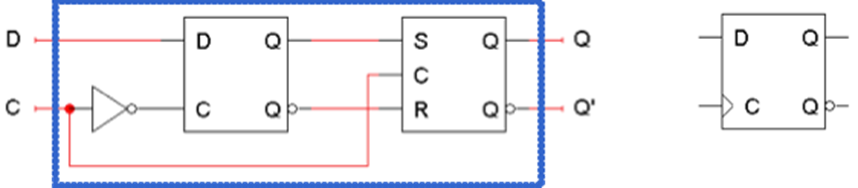

D플립플롭의 입력은 C(clock)과 D(data)이며, 출력은 Q와 Q'
왼쪽의 Dlatch는 마스터, 오른쪽의 SRlatch는 슬래이브
플립플롭의 입력 D는 마스터 래치에 직접 연결되며, 마스터 래치의 출력은 슬레이브의 입력이 된다. 슬래이브의 출력은 플립플롭의 출력이 된다. 

1. C = 0
  - 마스터 래치(Dlatch)가 **활성화** 되고, 플립플롭 입력 D를 모니터링 하며 D가 변경될 때마다 마스터의 출력도 변경
  - 슬레이브(SRlatch)는 **비활성화** 되어 있으므로 D래치의 출력은 아무런 영향을 미치지 않는다. 
  - 따라서 슬레이브는 플립플롭의 현재 상태를 유지한다. 
 
2. C = 1
  - 마스터 래치가 **비활성화**되고, 마스터 래치의 출력은 Clock이 1이 되기 직전의 마지막 D 입력값이 된다.
  - C가 1인 동안에 새로운 입력을 넣어도 마스터 래치에 아무런 영향을 미치지 않는다. 
  - 슬래이브 래치가 **활성화** 되어 마스터 래치의 출력을 반영하여 상태가 변경된다. 

** Positive Edge Triggering**
플립플롭의 출력 Q는 C가 포지티브 에지인 순간에만 변화한다.
이 변화는 클럭신호의 포지티브 에지에 있는 플립플롭 입력값을 기반으로 한다.

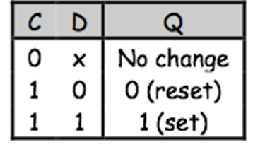

D플립플롭의 동작은 포지티브 에지 트리거 특성을 제외하고 D래치와 유사하다.

## JK Flip-flop

S'R'latch를 기반으로 다른 latch를 만든 것 처럼, D Flip-flop을 기반으로 여러버전의 플립플롭을 만들 수 있다. 
JK플립플롭은 S와 R처럼 동작하는 입력을 가지지만 입력 JK = 11은 플립플롭의 현재상태의 역수를 나타낸다. (Complement)

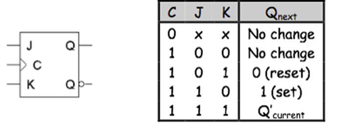

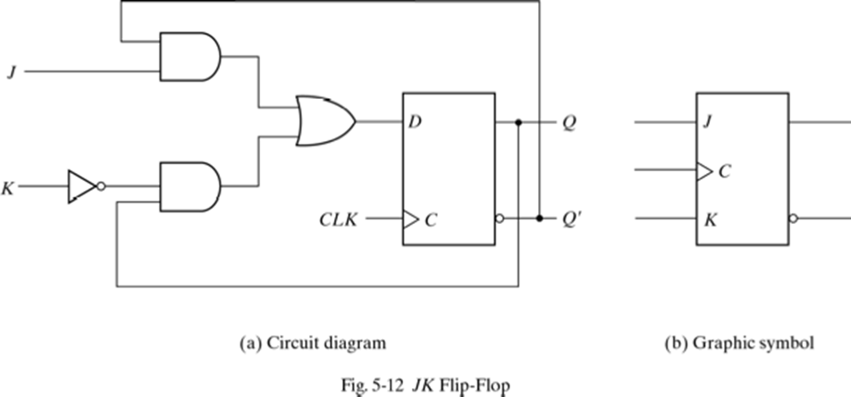

D Flip-flop으로 구현한 JK Flip-flop

## T Flip-flop

T플립플롭은 현재 상태를 유지(No change)하거나 역수(Complement)를 나타낸다.

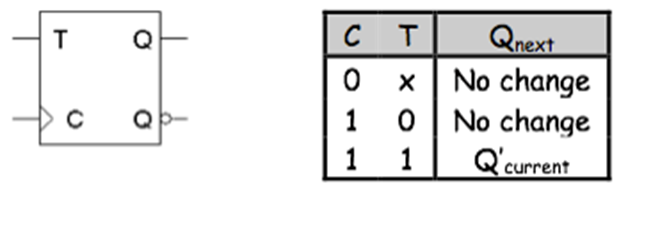

(a) JK Flip-flop으로 구현한 T Flip-flop
(b) D Flip-flop으로 구현한 T Flip-flop

### Summary

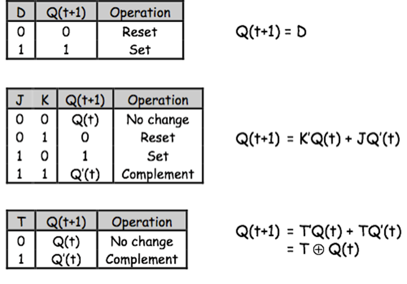

위의 표는 특성 테이블이라고 하며, 현재 상태의 Q와 다음상태의 Q를 보여준다.
단순화를 위해 제어입력 C는 대개 표현하지 않는다. 
위의 식은 다음 상태가 현재 상태 및 입력에 의해 정의되는 특성 방정식이다.

## Sequential Circuit

순차회로의 경우 출력은 입력 뿐만 아니라 플립플롭의 현재 상태에도 의존한다. 

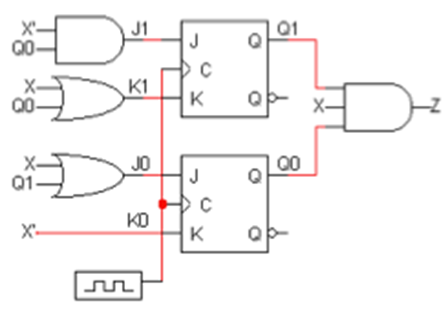

 하나의 입력 X, 하나의 출력 Z, 두개의 플립플롭 Q1, Q0가 있을 때, 입력 X와 플립플롭 Q1, Q0가 다음 상태의 출력을 결정한다.
* **Output**
  Z = Q1Q0X   // 모든 입력이 1일때 ANDgate로 인해 Z가 1
* **Input**
 1. 플립플롭 입력에 대한 **부울방정식**을 찾는다. 
 2. 각각의 실제 플립플롭 입력 값을 찾는다. **상태표** 채움.
 3. Input값과 현재 상태를 기반으로 플립플롭 상태표 또는 방정식을 이용하여 **다음 상태를 찾는다**.
 
 > Step 1. 
 >  J1 = X'Q0  ,  K1 = X + Q0  ,  J0 = X + Q1  ,  K0 = X '
 > Step 2. 
 >
 > 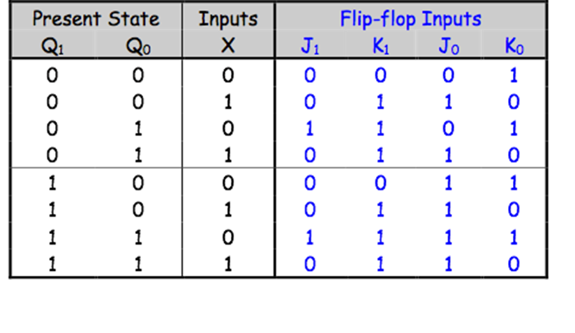
 >
 > Step 3. 
 > 일반적인 JK 플립 플롭 특성 방정식은 Q (t + 1) = K'Q (t) + JQ '(t).
예제 회로에서는 두 개의 JK 플립 플롭이 있으므로 각각에 적용.
Q1 (t + 1) = K1'Q1 (t) + J1Q1 '(t)
Q0 (t + 1) = K0'Q0 (t) + J0Q0 '(t)
 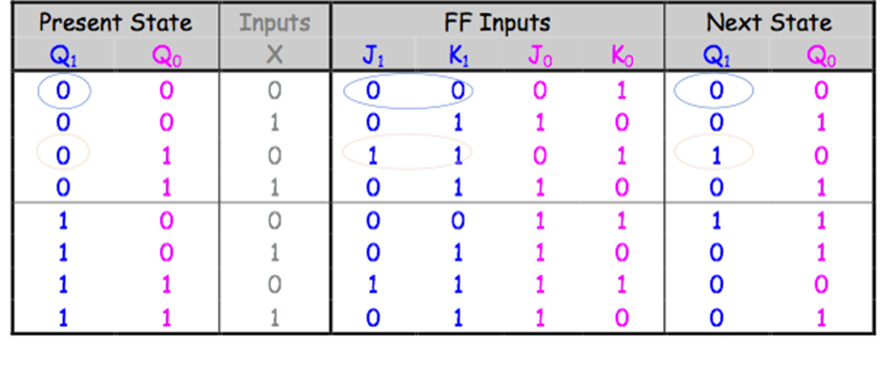

* **결과**

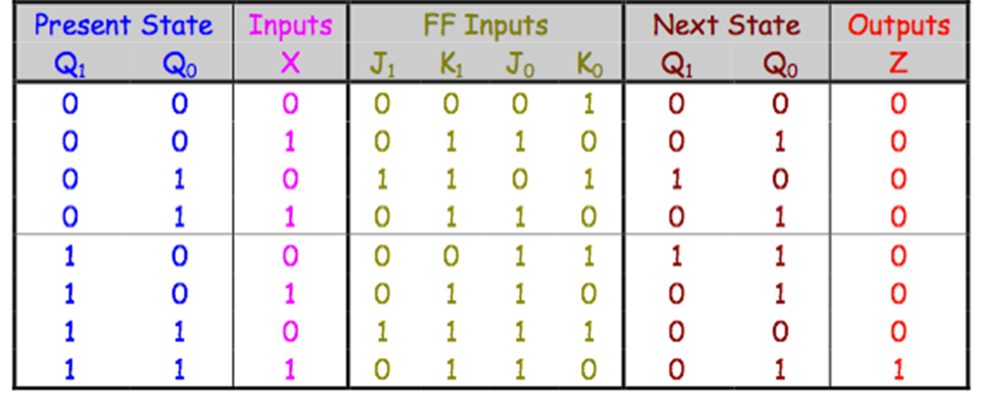

State Table

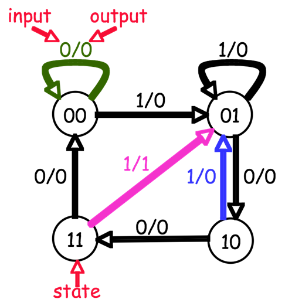

State Diagram

  - **TIP**
    : N개의 플립플롭이 있는 경우 다이어그램에 2N개의 노드가 있어야 함
    : M개의 입력이 있으면 각 노드에는 2M개의 나가는 화살표가 있어야 함
    즉, 이 예시에서는 2개의 플립플롭과 1개의 입력(X)이 있으므로 4개의 노드와 2개의 화살표가 필요하다. 