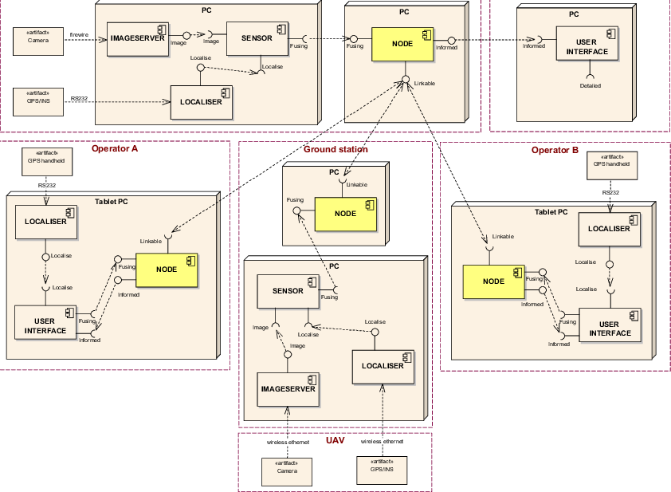

MultiCampus Study!!
===================


**[ 인프라구축강의 1일차 ]**  

----------


기술의 발전
-------------

기술이 발전하는 이유는 ? **개발자 편의성** 때문.. (사용자 편의성 X)

## 1.  프로그램 기법
	- 	50’s 절차중심적 기법
	- 	6,70’s 정보공학 기법 - DBMS
	- 	80’s 객체지향적 기법 – Smalltalk
	- 	90’s 객체지향 기법 – JAVA
	- 	컴포넌트기반 기법 – CBD (Component Based Development)  
  > **컴포넌트 vs Framework**
  > - 컴포넌트 : 기능 관련. 독립적인 단위 모듈
  > - Framework:  구조적인 것 관련. 대신해주는 것

<hr>

##  2. 구조적 측면  
  - MainFrame 시대 - 중앙 집중적, 일체형  
  - Desktop 시대 - 독립적  
  - Network 시대 - 이전의 사이즈 문제 해결 위한 (CS 시대)  
  - Web Site 시대 - Protocol: http, ftp..., 정적인 처리만 가능    

> **왜 Http가 대세가 되었나**
>  - 개발이 편하다. txt기반
>  - 표준화된 웹서버, 표준화된 클라이언트
>  - Connection Reset State 요청 이후 응답 하면 바로 연결 끊음


  - 동적 처리를 위한 웹서버랑 독립되지 않은 연결된 CGI(Component Gateway Interface)  
    -- But, request가 여러개 들어와도 하나만 처리 가능. 요청마다 process생성하기 때문에 자원(메모리) 공유가 안됨.      
  - Process : 자원을 공유하지 않은 실행중인 프로그램
  - Thread : 자원(정보,code)을 공유하는 실행 흐름  ex) 네스케이프사의 NS API, MS사의 IS API Thread 기반 CGI
  - 플랫폼 종속성(Platform Dependent) ex) 네스케이프의 NS
  - 플랫폼 독립성 + Thread 기능의 장점이 합쳐진 SUN의 JAVA -> Servelt

<hr>

##  3. Architecture
   html,css,js / CGI / Window탐색기 / ...  
   Servelt = Server + Application : 요청분석 -> 비즈니스 수행(처리) -> 응답  // Thread로 동작하고, 플랫폼 독립성  
   Model : Business Component // Servelt의 비즈니스 수행(DB접근...)을 분리해서 처리  
  == == == == == == == == == == == == == == == == == == == ==
   Java Code, Eclipse...  
   Java EE(Enterprise Edition) : ee.jar 컴파일 but, 실행은 안됨  +  Web Container : 구현체. 서포트해주는 인터페이스를 구현 한 코드 집합(ex. Tomcat, Resin, JRun...)  
   > **Heap**  
   >  
   > Instance영역 + Method영역  
   > Instance영역 = Young Generation + Old Generation  
   > Young Generation영역 = eden영역 + survive영역 2개
   > Method영역(Permanent Generation. PERM GEN) = 일반구조 + Static + Final(String Iiteral pool: 문자열이 올라가는 구역) + 기타영역  
   >  
   > **None-Heap**  
   >

   Java SE(Standard Edition) : JRE (JVM + RunTime.jar...) - JRE가 ByteCode(.class)를 ClassLoader가 읽어오도록 시키고 그를 해석. JVM가 load하는데 main제외한 static멤버 초기화해서 메모리에 load해옴.   
  == == == == == == == == == == == == == == == == == == == ==  
   Any Web Server (ex. Apache, Nginx, IIS, NS...) -> http Listener : http이해하는 프로그램. 따라서 요청을 이해할 수 있음    
   Any O/S  
   Any H/W  


 <hr>


**[ 인프라구축강의 2일차 ]**  

----------


Enterprise Web Architecure
-------------

Software Architecure는 소프트웨어 구성요소들 사이에서 관계표현. 설계와 업그레이드를 통제하는 지침과 원칙
Enterprise Architecure은 JAVA로 개발되어 있기 때문에 JAVA필수.
Multi User 수용하는 SYSYTEM. 안정성 중요하기 때문에 JAVA쓰는 것.  

> **로드밸런싱**  
> 수평적인 확장이 가능하게끔 만들어주는 것.  
> 들어오는 요청을 서버 중 하나로 라우팅 처리해주며, 클라이언트로 응답.  
> 즉, 서버의 과부하를 막아주기 위해 요청을 분산시키는 일  

> **Dynamic Load**  
> JAVA는 독적으로 클래스를 읽어옴.  
> 런타임에 모든 코드가 JVM에 링크된다.
> 모든 클래스는 그 클래스가 참조되는 순간에 동적으로 JVM에 링크되며, 메모리에 로딩된다.  

## 1. Client - Server Pattern  
다수의 Client, 하나의 Server.

<hr>

**[ 인프라구축강의 3일차 ]**  

----------


Docker
-------------

docker_sample.word 를 참고하여 Docker로 Mysql 사용하기  

[구조]  
...  
MySQL Client / MySQL Server  
Debian 9  
Docker  
Guest OS(Ubuntu 16.04)  
VM ware  
Any OS  
Any H/W  

------------

Diagram Architecure
-------------


Architecure Diagram Example   

> **Tip**
> visual paradigm <https://online.visual-paradigm.com/diagrams.jsp#diagramlist:proj=0&new=AWSDiagram>   


<hr>

**[ FullStack 1일차 ]**  

----------
HTML/CSS
-------------  
## 1. 3-Tier  
- Client  
- Server  
- Storage :  컴퓨터 프로세서가 접근할 수 있도록 전자기적인 형태로 데이터를 저장하는 장소를 말한다. 1차 스토리지는 램과 기타 여러 내부 장치들에 있는 데이터이며, 2차 스토리지는 하드디스크, 테이프, 그리고 기타 외부 장치들에 있는 데이터   


> **SPA**  
> Single Page Application  
> 비동기화 호출로 메모리를 유지, 다른 페이지에서 그대로 사용  
> 서버로부터 완전한 새로운 페이지를 불러오지 않고 현재의 페이지를 동적으로 다시 작성함으로써 사용자와 소통하는 웹 애플리케이션이나 웹사이트를 말한다. 이러한 접근은 연속되는 페이지들 간의 사용자 경험의 간섭을 막아주고 애플리케이션이 더 데스크톱 애플리케이션처럼 동작하도록 만들어 줌.  
> 장점: BandWidth 적어짐  
> 단점: 오히려 Request가 보이지 않게 계속 갈 수도 있음 - Network가 바쁜상태라면 Server에서도 무리, DB Access도..    
> 따라서 비기능적 요구사항(node개수, H/W사양, Contents의 방식, DB,...)까지 파악해서 설계해야..  


## 2. 표현기술  
- Client : Html, CSS, JS  
- Server : jsp, asp, php //모든 처리 후, 결과 html을 포함  
- .jsp에는 80%정도의 html이 있어야 함.. 그게 좋은 구성  


## 3. jsp
- jsp파일 사용하는 프로그램은 반드시 WEB-INF 폴더가 있고, 그 속에 web.xml이 있다  
- web.xml은 많은 정보가 포함되어 있기에 보안 중요  
- apache-tomcat-8.5.41 bin startup.bat 했을때 jdk가 설치가 안되어 있으면 실행 안됨. 설치 후 실행(localhost:8080)  

## 4. Enterprise Web Architecture 구성  
1. Tomcat설치  
2. jdk설치  
3. JAVA_HOME 환경변수 설정  

## 5. 구조
apache-tomcat에 webapps에 보면 5가지의 context가 있는 것.  
 : docs, examples, host-manager, manager, ROOT   
각자 메모리 스택을 다른 것 사용. 공유하지 않음  

> **Tip**  
> 수정할 파일에서 오른쪽 클릭 open with web page editor  
> window->show view -> other -> general -> palette  
> 편하게 UI 구성할 수 있게 됨!  


## 6. jsp 파일 사용하기  
- 넘어온 값을 출력하기 <% ... %>  
 	1. String id = request.getParamether("id");  
	2. out.println(id); //사용자 버퍼에 출력. 브라우저에 출력  


## 7. Model Architecture  
 **1. Model 1 Architecture**  
 	: JSP파일 내에 View와 Controller 모두 실행되는 구조  

 **2. Model 2 Architecture**  
	: Servlet 사용하여 view와 Controller 분리한 구조  
	: JSP는 View를 담당, Java Class에서 비즈니스 로직 담당    
>
	  1. Servlet 생성  // New -> Servlet -> Java package = web.controller , Class name = MainServelt 으로 지정 -> next   
	  2. Servlet 설정  // URL mappings /Main으로 설정.-> next  모든 요청이 Servelet을 거치도록 설정. but Servlet로 경로 알 수 없어야 함.  
	  3. Servelt 설정2 // constructors from superclass 체크 해제    
	  4. Restarting Server  
	  5. index.html의 form action = "Main?sign=login"으로 바꿈  
	  6. MainServelet.java에서 process 메소드 안에 sign이 login으로 왔는지 검사 후 처리  
>
 **3. MVC패턴**


 **4. 기초 보안 설정**
	- MainServlet.java에 process라는 메소드 만들기(doPost메소드 복사 후 이름만 process로 바꿔)  
	- doGet, doPost메소드 안에 process(request,response) 메소드 호출  
	- process(HttpServletRequest request, HttpServeltResponse response)는 모든 요청 메소드를 process로 포워딩 시키는 메소드  
	- index.html form태그안에 method = "post"로 설정해서 url에 매개변수 뜨지 않게 설정  

<hr>

**[ FullStack 2,3일차 ]**  

----------
HTML/CSS
-------------  

**1. HTML5 고급 문서 작성**  
  
> **submit vs button**  
> submit은 서버 측에 CGI를 action을 처리해 달라고 요청할 때 사용   
> button은 개발자가 직접 처리를 해야 함. JS 같은거로,, 

**2. jsp 파일 분리**
- index.jsp에 header.jsp, side.jsp, content.jsp...로 나눠 표현
- <jsp:include page="header.jsp"></jsp:include>
- 상대경로 지정으로 url이 꼬일 때는 절대경로로 지정! /프로젝트명/...


----------  
JavaScript  
-------------  

**JavaScript Prototype**
## 1. 개념  
JavaScript는 프로토기반 언어. 자바스크립트도 객체지향언어인데 클래스 개념이 없음.
상속기능 등 객체지향의 특징을 이용하기 위해 프로토타입을 이용
ECM6 표준에는 Class가 추가되었다. 클래스기반으로 바뀐것은 아님


## 2. 사용 예시  
```javascript
function Person() {
  this.eyes = 2;
  this.nose = 1;
}
var kim  = new Person();
var park = new Person();
console.log(kim.eyes);  // => 2
console.log(kim.nose);  // => 1
console.log(park.eyes); // => 2
console.log(park.nose); // => 1
```
kim과 park은 eyes와 nose를 공통적으로 가지고 있는데, 메모리에는 eyes와 nose가 각각 할당되어 메모리 소비 큼  

```javascript
function Person() {}
Person.prototype.eyes = 2;
Person.prototype.nose = 1;
var kim  = new Person();
var park = new Person():
console.log(kim.eyes); // => 2
...
```
eyes와 nose를 어딘가에 넣어놓고 공유하여 사용  
Person.prototype이라는 빈 object가 어딘가에 존재하고, Person함수로 생성된 객체들도 어딘가에 존재하는 Object에 들어있는 값을 모두 갖다 쓸 수 있다.  

## 3. 카드뒤집기
```html
 <!DOCTYPE html>
 <html>
     <head>
        <script>
          function image_onclick(img){
              var images = new Array("C:/a.jpg","C:/a2.jpg","C:/a3.jpg");
              var imgSource = document.getElementById(img);
                  if(img.endsWith("img1"))
                  imgSource.src = images[1];
                  else if(img.endsWith("img2"))
                  imgSource.src = images[2];
              setTimeout(function(){imgSource.src = images[0]},1500);
          }
        </script>
     </head>

     <body>
        <h2>카드뒤집기</h2>

        
        


     </body>
 </html>

```

----------  
Java get/set vs Javascript get/set
-------------  

## 1. Java vs JS  

class Hello{  
 data  
 method  
 숫자 - 정수(byte, int, short, long), 실수(float, double)  
 	int, double이 기본타입  
 단일문자 - char  
 논리 - boolean  
}  
시작메서드가 없으면 안돌아감  

vs  

//class Window{  
 data  
 method
 단일문자형 없음 그냥 var. 모두 string  
 논리도 var  
//}  
<script>에 넣으면 바로 실행  
	
 <br>	
  
## 2. DOM(Document Object Model) vs BOM(Browser Object Model)  
  
- DOM  
문서의 구조화된 표현. 웹페이지의 객체 지향 표현  
웹페이지를 JS로 제어하기 위한 객체 모델  
윈도우에 로드된 문서를 의미  

- BOM
자바스크립트가 브라우저와 소통하기 위한 모델.  
웹 브라우저의 창이나 프레임을 추상화하여 프로그래밍적으로 제어할 수 있도록 제공하는 수단  


<br>  
## 3. get, set   

일종의 시큐어코딩.  
객체의 필드에 직접 접근하지 않는 법  
만약 외부에서 직접 데이터(필드)에 접근하게되면 객체의 무결성이 깨질 수 있음  
따라서 필드를 private로 하여 외부 접근 제한하고, setter를 사용헤 값을 가공할 수 있도록 함  
마찬가지로 getter를 사용해 본 필드의 값을 숨기고 내부에서 가공된 값을 가져올 수 있게 함  
