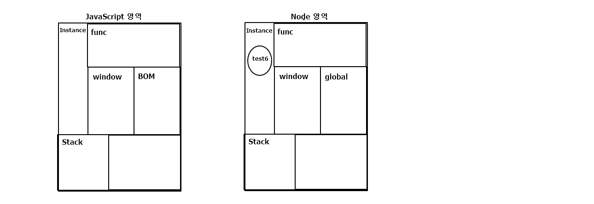

# Node.JS

자바스크립트 런타임(실행환경)  
이벤트기반, 논블로킹 I/O모델(비동기 I/O)을 사용해 가볍고 효율적  

> **tip**
> * vs에서 ctrl+` 하면 terminal창 열리고, node test1.js 하면 실행 됨  
> * 코드 실행과정을 보여주는 곳 [http://latentflip.com/loupe/](http://latentflip.com/loupe/)


## 객체 리터럴 

여기서의 리터럴은 변수 및 상수에 저장되는 **값 자체**를 일컫는 말  
리터럴표기법이란 변수를 선언함과 동시에 그 값을 지정해 주는 표기법  
코드가 짧기 때문에 자바스크립트 인터프리터의 해석분량도 줄어들어 빨라진다.  
즉, 코드 간결성과 속도 때문에 사용한다.  

```javascript

const sayNode = function () {
    console.log('Node');
};
const es = 'ES';
const newObj={  //객체 리터럴
    sayJS() { //객체 메서드에 함수 연결할 때 sayJS라는 함수가 할당되어 있구나
        console.log('JS');
    },
    sayNode, //sayNode라는 변수 혹은 함수가 할당되어 있구나 ----- 1
    [es+6]: 'Fantastic', //변수가 됨 ES6이라는 이름의 값의 동적naming
};

newObj.sayNode(); //newObj의 sayNode() 호출 ----- 2 이때는 변수인지 함수인지 명확히 알아야함
newObj.sayJS();
console.log(newObj.ES6);
console.log(newObj.es6);

```




## 화살표 함수

일반적인 function표현에 비해 구문이 짧고 this, arg, super, new target을 바인딩하지 않는다.  
항상 익명이다.  
그래서 생성자로 사용할 수 없다.  

```javascript

console.log(this); 

function add(x,y){ //독립적 함수
    console.log(this===global); //true
    return console.log(x+y);
}

var add2 = function(x,y){  // add2변수에 할당된 함수
    console.log(this===global);
    return console.log(x+y);
}

const add3 = (x,y) => { // 화살표함수
    console.log(this===global); //false
    console.log(this); //자기문서객체
    return console.log(x+y);
}

const add4 = (x,y) => (console.log(x+y)); //화살표함수의 축약 한줄짜리 함수일 경우
const add5 = x => console.log(++x); //하나의 파라미터 받을때 소괄호 생략가능

add(10,20);
add2(10,20);
add3(10,20);
add4(10,20);
add5(10);

```
화살표함수 사용하면 this를 사용하여 자기자신의 함수를 표현할 수 있음 
global이 아니라  

* **Java 람다식으로 NodeJS 화살표함수 이해하기**  

 람다식은 자바8부터 추가된 개념으로 **'식별자 없이 실행 가능한 익명의 함수 표현식'**  

```java
import java.awt.Button;
import java.awt.Frame;
import java.awt.TextArea;

public class Main {
	Frame f = new Frame("My Frame");
	TextArea ta = new TextArea();
	Button b = new Button("Send");

	public void onCreate() {

//		b.addActionListener(new ActionListener(){
//			@Override
//			public void actionPerformed(ActionEvent e) {
//				// callback
//				// if) Main에 있는 TextArea (ta)에 출력하고 싶은 경우
//				ta.append(this + "\n");
//			}
//		});
		
		b.addActionListener(e-> ta.append(this + "\n"));
		
		f.add(ta, "Center");
		f.add(b, "South");
		f.setSize(400, 500);
		f.setVisible(true);
	}

	public static void main(String[] args) {
		// TODO Auto-generated method stub
		Main m = new Main();
		m.onCreate();
	}
}

```


## this
  
* JavaScript에서 this가 만들어지는 경우  
1. 일반 함수에서 this -> window  
2. 중첩 함수에서 this -> window  
3. 이벤트에서 this -> 이벤트 객체  
4. 메소드에서 this -> 메소드 객체  
5. 메소드 내부의 중첩 함수에서 this -> window  

* NodeJS에서 this의 의미  
Node에서 window와 document는 Node에 없는 객체.  
두 객체는  브라우저 런타임에서 넣어주는 객체이기 때문..  
노드는 브라우저와는 다른 런타임이기 때문에 DOM과 관련된 두 객체를 넣지 않음..  

* **Node에서 this 사용하기**  

전역환경에서의 this는 module.exports 파일을 모듈로 사용할 수 있게 해주는 객체  
함수선언문 안의 this는 global  
화살표함수의 경우 this는 상위환경의 this를 물려받기 때문에 module.exports  
즉. 전역환경에서의 this와 화살표함수의 this는 module.exports이다!!  

**만약 특정함수 내에서 지역변수명과 동일한 외부의 전역변수를 참조하려면, this를 사용해서 this.전역변수명 형식으로 참조해야한다.**  


## 비구조화 할당

```javascript

var candyMachine = {
    status: {
      name: 'node',
      count: 5
    },
    getCandy: function(){
        this.status.count--;
        return this.status.count;
    },
};

// var getCandy = candyMachine.getCandy;  // 객체의 dep이 깊어지면 하나의 변수에 담고싶어짐,, 하지만 this가 바뀌기 때문에 에러됨
// var count = candyMachine.status.count; // 얘도..

console.log(candyMachine.getCandy());

// const { getCandy, status: {count}} = candyMachine; // 왼쪽에 {참조하고 싶은 변수,함수} 오른쪽에 할당하고 싶은 객체 씀 but, 얘도 this때매 에러

```

## 모듈

노드는 코드를 모듈로 만들수 있다.  
모듈은 특정 기능을 하는 함수나 변수들의 집합  
require('url'); 을 통해 import  


## Server 구축

```javascript
const http = require('http');
const fs = require('fs');


http.createServer((req, res) => {
    fs.readFile('./server2.html', (err, data) => {
        if (err)
            throw err;

        res.writeHead(200, { 'Content-Type': 'text/html; charset=utf-8' });
        //정상
        res.end(data);
    });
}).listen(8888, () => {
    console.log('server ready...');
});
```
  
> **tip**   
> favicon.ico 는 공식 제공 페이지임을 확인해 줌   
  

## Web Site vs Web Application

* Web Site  
html, css, js  

* Web Application  
Node 엔진 V8에서 돌아가는 http모듈, fs모듈 이용...  


## Mash up  

인터넷에서 제공되는 서비스와 기능을 합치고 응용하여 새로운 서비스를 만들어 내는 것  
ex) google chart api   


## Event

.on 과 .addListener 는 같은 기능한다. .on()을 더 선호
